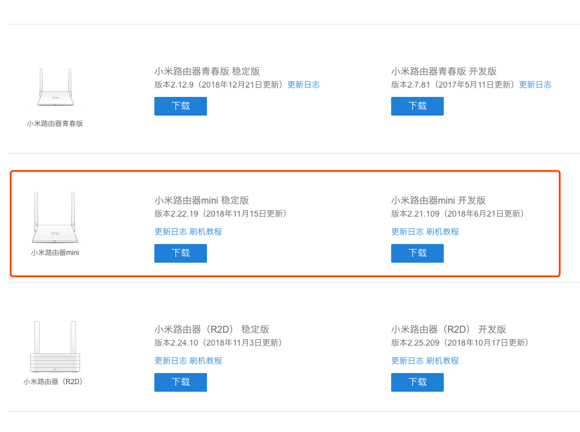
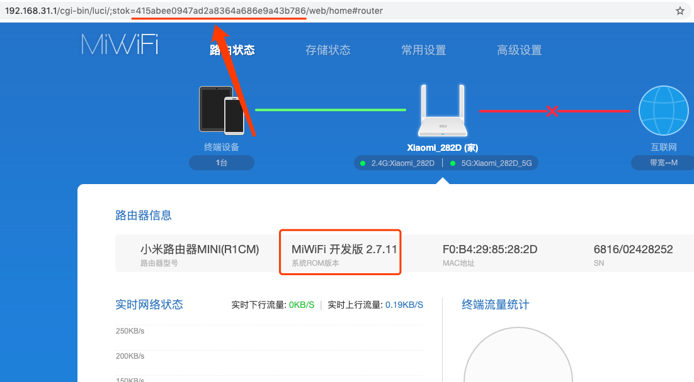

由于小米路由器关闭了 SSH 的正常通道，导致我们无法极客一些第三方的系统，如：Pandova/老毛子 等固件，这篇教材主要来解决破解 SSH 登录的问题：

> 使用前请务必记得: **降级**

*固件下载：*

- 本站镜像(Github 走国外下载)
  
  [miwifi_r1cm_firmware_b9d56_2.7.11.bin](roms/miwifi_r1cm_firmware_b9d56_2.7.11.bin)

- 官方渠道(小米本地下载)

  [miwifi_r1cm_firmware_b9d56_2.7.11.bin](http://bigota.miwifi.com/xiaoqiang/rom/r1cm/miwifi_r1cm_firmware_b9d56_2.7.11.bin)


# 第一步

首先，访问 http://www1.miwifi.com/miwifi_download.html 来确定当前的 `ROM` 是否与你的路由器匹配，我这里的是如图所示的型号：



# 第二步

参考官方 [刷机教程](https://www.xiaomi.cn/post/9515640) 格式化 U 盘并拷贝上述下载的固件进行降级处理。

> 注意：这里一定要使用 Windows 的 FAT32 方式格式化，我尝试过用 MacOS 电脑的 FAT32 格式化磁盘后路由器无法正常的读取，按教程操作后一直红灯，切记！切记！切记！

此步骤完成之后应该就能正常进入到路由器的管理界面来进行设置路由器了，把 WiFi 的密码与管理员密码输入完毕之后进入下一步。

# 第三步



按照上图所示，把 `stok` 参数中的会话编号进行复制（ `415abee0947ad2a8364a686e9a43b786`）并执行下列命令：

```shell
➜ python3 Mini.py
Paste your session here: 812a067e2cd13b579d9c0b9d0243fdd3
Prepare hacking your MiRouter
b'{"msg":"","savename":"payload","code":0}'
b'{ "code": 0, "msg": "" }'y
b'{ "code": 0, "msg": "", "taskId": 1 }' 
b'{ "code": 0, "msg": "" }' it                
b'{ "code": 0, "msg": "" }'ploit it                
>>>>>>>>>>>>>>>>>>>>>>>>>> done                
Reboot your Router and get the ssh,enjoy :)
```

按照上述步骤成功后重启路由器....

# 第四步

尝试利用 SSH 进入路由器，密码在 `payload` 文件中（默认 `admin`），如下所示：

```shell
➜ ssh root@192.168.31.1

BusyBox v1.19.4 (2015-10-26 14:41:37 CST) built-in shell (ash)
Enter 'help' for a list of built-in commands.

 -----------------------------------------------------
	Welcome to XiaoQiang!
 -----------------------------------------------------
root@XiaoQiang:~#
```

# 最后

有任何问题欢迎大家提 Issue 来询问解决，因为我这里用的路由器型号可能与大家的不相同，所以其它型号的需要你们自己测试测试，希望你们成功后可以把自己的破解过程分享给到我这里，谢谢！

另外，非常感谢原作者 https://github.com/Aster-the-Med-Stu/XiaoMi-Mini-SSH-Hacking 的贡献。